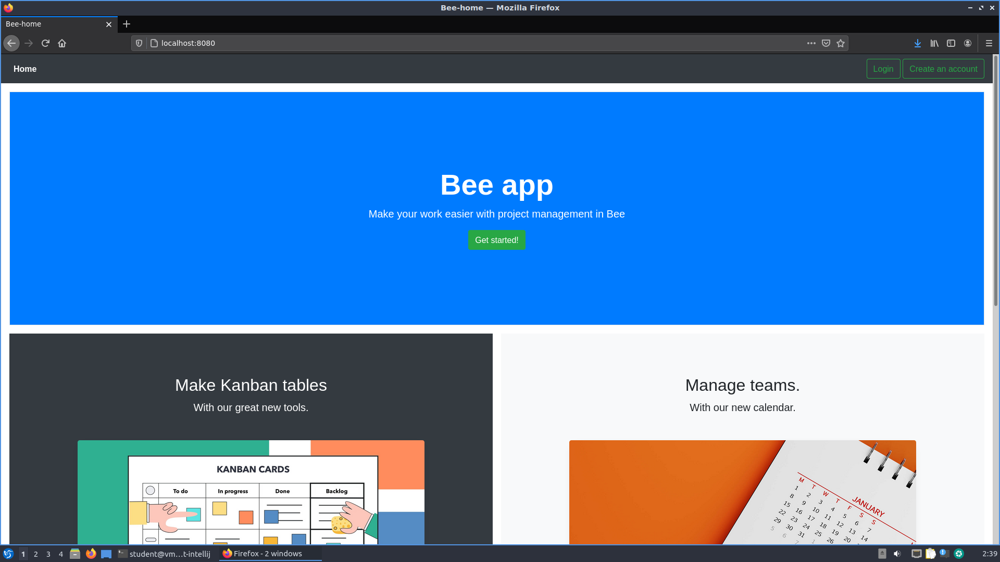

# Bee
The goal of the project is to create a simple team management application. Our application will improve the work of teams creating projects, organizing work and sharing ideas

## Table of Contents
* [General Info](#general-information)
* [Technologies Used](#technologies-used)
* [Features](#features)
* [Screenshots](#screenshots)
* [Setup](#setup)
* [Usage](#usage)
* [Project Status](#project-status)
* [Room for Improvement](#room-for-improvement)
* [Acknowledgements](#acknowledgements)
* [Contact](#contact)
<!-- * [License](#license) -->

## General Information
The project is aimed at creating a product for companies of various sizes that need to organize work for their teams. Our tool will enable a flexible division of tasks for each team member, the ability to control the creation of projects, efficient information flow and communication between group participants. The main idea that accompanied us when creating the project was to enable the most effective remote work in the current pandemic conditions. Thanks to our application, companies will not only be able to effectively work remotely, but also facilitate the work of teams in normal office conditions.
<!-- You don't have to answer all the questions - just the ones relevant to your project. -->

## Technologies Used
- Java
- Spring Boot
- HTML
- Thymeleaf
- JavaScript
- Docker

## Features
List the ready features here:
- new user registration
- login for existing users
- creating teams and assigning users to them
- creating projects for teams
- adding comments to projects
- editing and deleting teams, projects and comments

To do:
- create kanban tables
- create calendar
- create a brainstorming tool

## Screenshots

<!-- If you have screenshots you'd like to share, include them here. -->

## Setup
<!-- To run our program, clone this repository to your Linux system. Then write a commands -->

## Usage
<!--How does one go about using it?--!>
<!--Provide various use cases and code examples here.-->

<!--`write-your-code-here`-->

## Project Status
Project is: _in progress_

<!-- ## Room for Improvement-->
<!--Include areas you believe need improvement / could be improved. Also add TODOs for future development.-->

<!--Room for improvement:--!>
<!--- Improvement to be done 1-->
<!--- Improvement to be done 2-->

<!--To do:-->
<!--- Feature to be added 1-->
<!--- Feature to be added 2-->

## Acknowledgements
- This project was inspired by...
- This project was based on [this tutorial](https://spring.io/guides).
- Many thanks to our Professors.

## Contact
Created by [@IncorporateUS](https://www.incorpoateus.pl/) - feel free to contact me!
